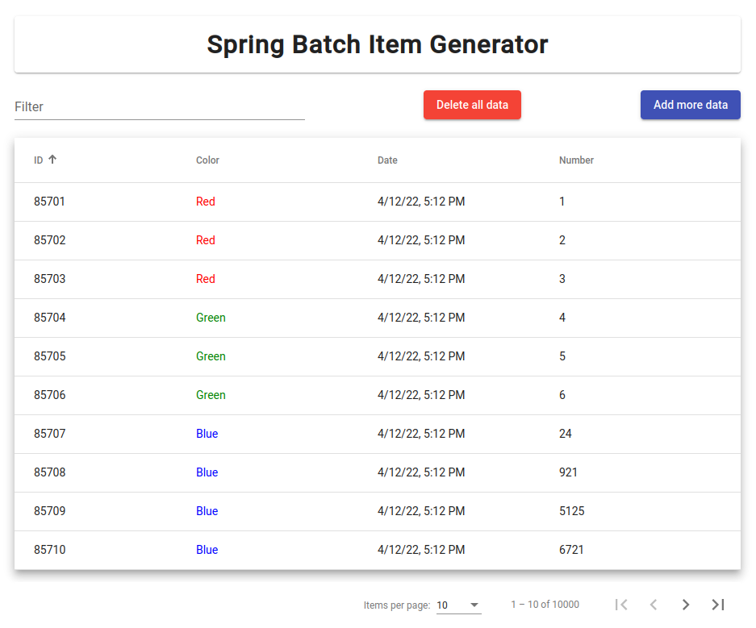

# Spring Batch Item Generator
This project consists of three parts
- A Spring Boot backend which includes Spring Batch data processing and an API
- An Angular front end to call the Spring Boot backend API methods and display our data
- A PostgreSQL database to store the application data

## How to run this project
This project requires Docker and Docker Compose to run. 

 The first step is to build the Spring Boot Backend.

```
cd /batch-demo-be

./mvnw clean install -DskipTests
or (If Maven is installed)
mvn clean install -DskipTests
```

The next step is to run the docker-compose.yml file. This will create individual containers for the Spring Boot backend, the Angular frontend, and the PostgreSQL database. 

```
docker-compose up --build
```

The first time the application is built can take several minutes while dependencies are downloaded. Subsequent launches of the application can be ran with the --build option omitted for a faster launch.

```
docker-compose up
```

After the containers start open your browser on http://localhost:4200/ to access the application.

## Spring Boot Backend Info
Contents exist within the batch-demo-be folder

This Spring Boot project contains a Sprint Batch job that writes data to the PostgreSQL database. The batch job runs when the application starts and can be triggered to run again via an API Endpoint.

### API Endpoints
- localhost:8080/api/runBatchJob
  - Trigger the batch job to run
- localhost:8080/api/getExportData
  - Return the contents of the export_data table in JSON format
- localhost:8080/api/deleteAll
  - Delete the contents of the export_data table

## Angular Frontend Info
Contents exist within the batch-demo-fe folder

The Angular Frontend consists of an Angular Material UI Table with sorting, filtering, and pagination. The buttons 'Add more data' and 'Delete all data' hit the Spring Boot Backend APIs and refresh the table automatically.

